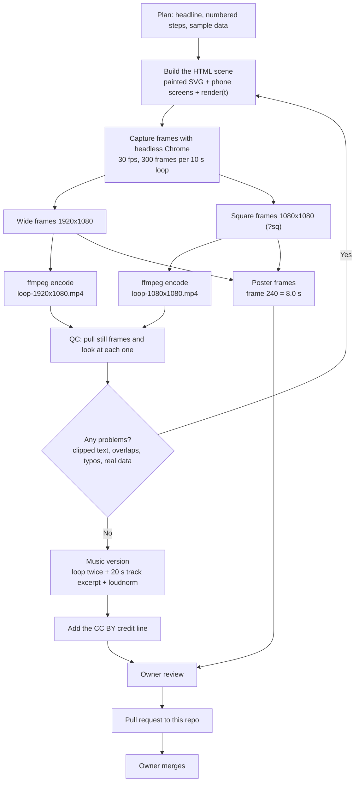
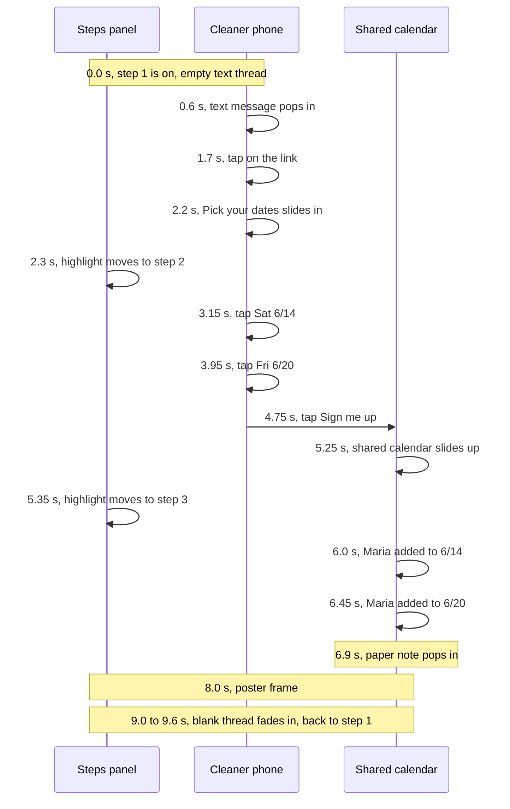
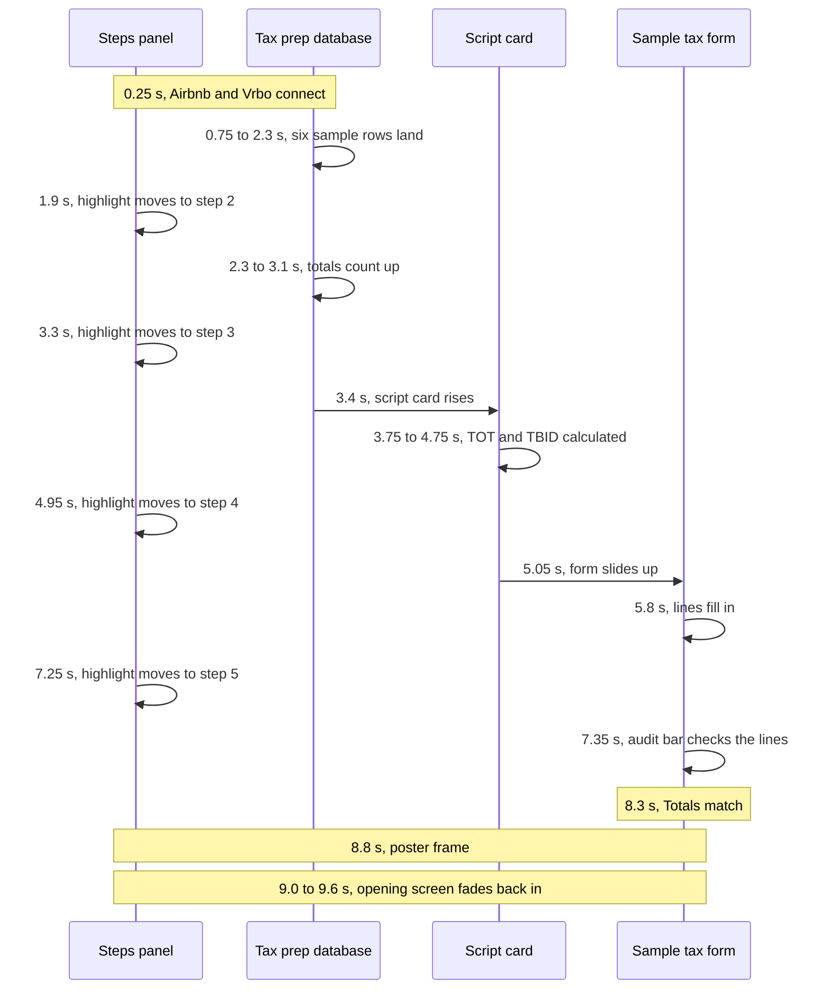
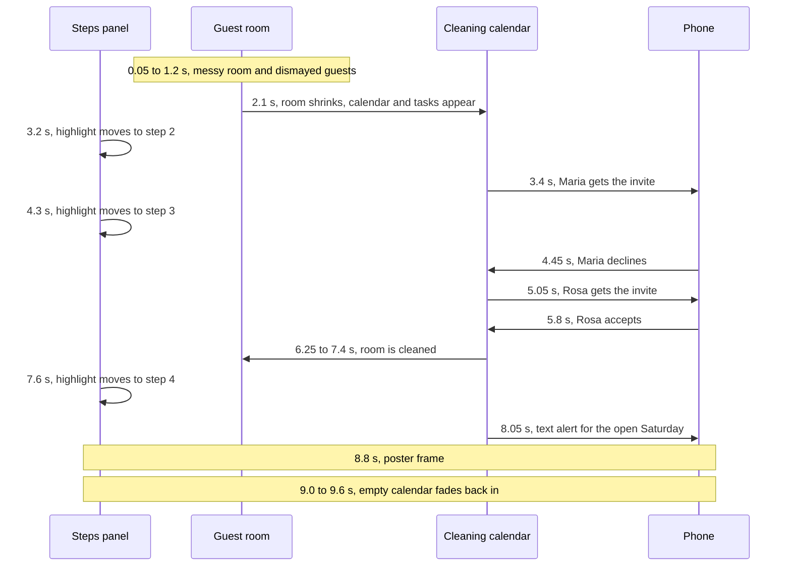

# Workflow diagrams

## Production pipeline

## The 10 second loops

Each video is a 10 second loop. These diagrams show the beats in order. Times are seconds into the loop.

### Schedule your cleaners by text

### Monthly TOT and TBID tax prep

### When your cleaner can't make it, the next one is asked automatically

