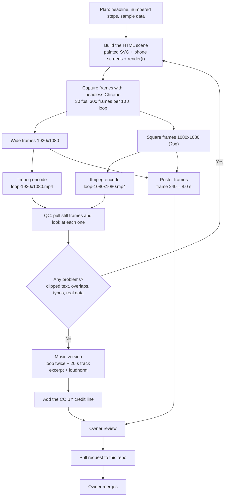
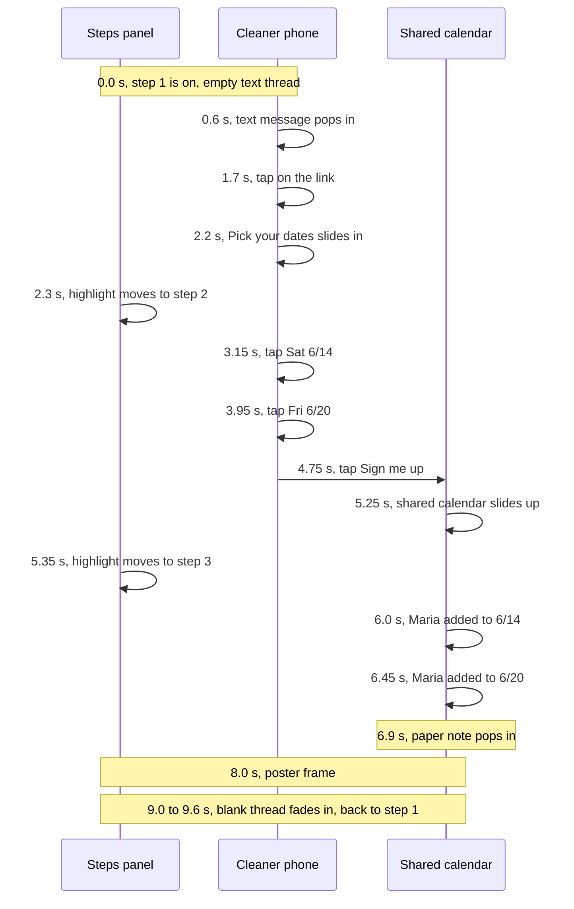

# Workflow diagrams

## Production pipeline

```mermaid
flowchart TD
    A["Plan: headline, numbered steps, sample data"] --> B["Build the HTML scene<br/>painted SVG + phone screens + render(t)"]
    B --> C["Capture frames with headless Chrome<br/>30 fps, 300 frames per 10 s loop"]
    C --> D1["Wide frames 1920x1080"]
    C --> D2["Square frames 1080x1080 (?sq)"]
    D1 --> E1["ffmpeg encode<br/>loop-1920x1080.mp4"]
    D2 --> E2["ffmpeg encode<br/>loop-1080x1080.mp4"]
    D1 --> P["Poster frames<br/>frame 240 = 8.0 s"]
    D2 --> P
    E1 --> Q["QC: pull still frames and look at each one"]
    E2 --> Q
    Q --> R{"Any problems?<br/>clipped text, overlaps, typos, real data"}
    R -- "Yes" --> B
    R -- "No" --> M["Music version<br/>loop twice + 20 s track excerpt + loudnorm"]
    M --> C2["Add the CC BY credit line"]
    C2 --> V["Owner review"]
    P --> V
    V --> G["Pull request to this repo"]
    G --> H["Owner merges"]
```

## The 10 second loop: cleaner scheduling video

```mermaid
sequenceDiagram
    participant S as Steps panel
    participant P as Cleaner phone
    participant C as Shared calendar
    Note over S,P: 0.0 s, step 1 is on, empty text thread
    P->>P: 0.6 s, text message pops in
    P->>P: 1.7 s, tap on the link
    P->>P: 2.2 s, Pick your dates slides in
    S->>S: 2.3 s, highlight moves to step 2
    P->>P: 3.15 s, tap Sat 6/14
    P->>P: 3.95 s, tap Fri 6/20
    P->>C: 4.75 s, tap Sign me up
    C->>C: 5.25 s, shared calendar slides up
    S->>S: 5.35 s, highlight moves to step 3
    C->>C: 6.0 s, Maria added to 6/14
    C->>C: 6.45 s, Maria added to 6/20
    Note over C: 6.9 s, paper note pops in
    Note over S,C: 8.0 s, poster frame
    Note over S,C: 9.0 to 9.6 s, blank thread fades in, back to step 1
```
